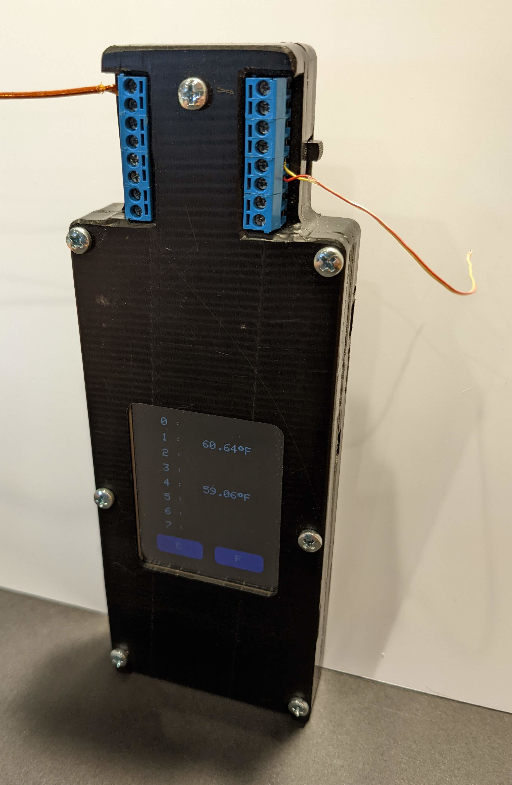

# thermocouple_reader

Handheld 8 channel temperature sensor.  Supports up to 8 type k thermocouples.  Displays temperatures in F or C.

The design uses off the shelf microcontroller board and LCD with a custom thermocouple input board.  The 8 thermocouple channels are muxed to a single interface IC to reduce component costs.  The microcontroller cycles through the mux inputs to read each channel in series, sampling multiple time to mitigate input noise.

